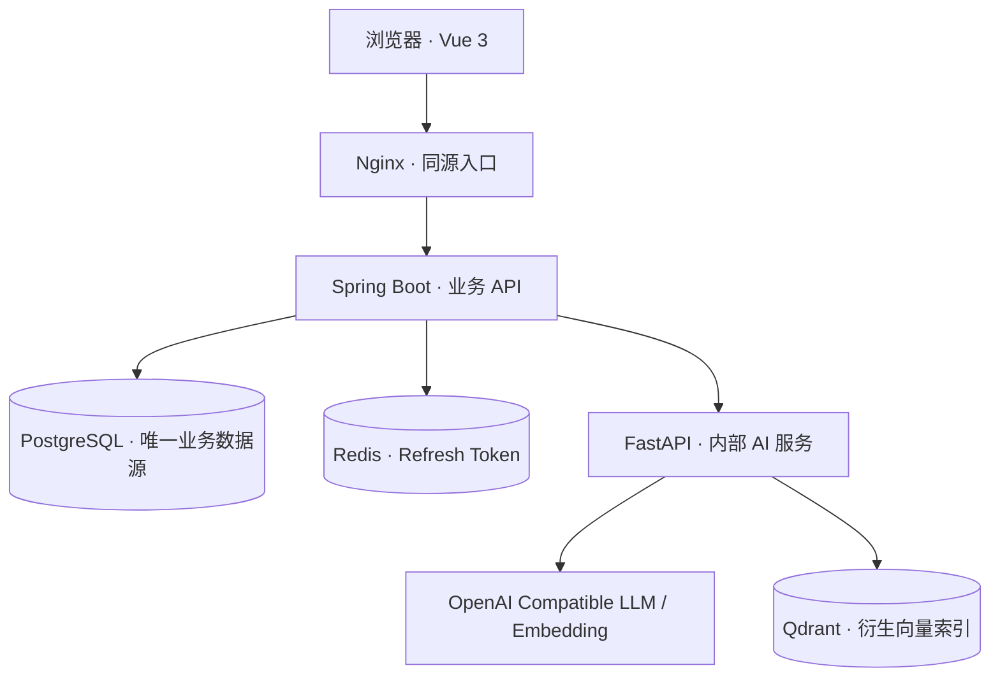

# 架构与开发边界

## 服务职责

Spring Boot 管理认证、错题、复习、学习记录、时政、素材、统计、定时任务和持久化 AI 任务。

FastAPI 负责校验后的模型输出、Embedding、向量检索、来源受约束的时政整理和 RAG。使用单独的内部访问令牌；浏览器从业务 API 访问 AI 功能。

业务写入先提交 PostgreSQL，随后执行 AI 任务。向量数据可重新生成；AI / Qdrant 故障不能回滚已录入的错题。数据库连接失败返回明确的服务错误，不能伪造保存成功。

## 第一版约束

只有一个账号，无注册接口。首次启动使用环境变量初始化用户名和 BCrypt 密码，之后从数据库读取，不在重启时覆盖。右上角个人设置支持修改用户名、密码和头像；修改用户名及密码需验证当前密码，并限制连续错误尝试。密码更新会递增凭据版本，立即使旧访问令牌和刷新令牌失效。访问令牌短时有效，刷新令牌保存在 Redis，刷新时轮换；禁止输出凭据到应用日志。头像在服务端验证图片内容并缩小、重编码为 PNG，保存于数据库并随备份保留。

模型 Token 用量从提供方返回的 `usage` 读取，不按文本长度估算。AI 服务将每个请求中的学习/向量模型调用汇总在内部响应头中传回 Java；Java 在读取业务响应前写入 `ai_usage`，包含模型、接口主机、调用数、已上报 Token 和缺失上报次数，不保存提示词、回答或 API Key。独立事务保存用量，使业务输出校验失败及事务回滚仍能保留已消耗用量；事件 UUID 保证响应去重。统计按服务器时区的日历日汇总，重启和数据库备份可保留。历史未记录用量不补造；服务未返回用量的调用单独标注。

原始新闻保存来源及抓取时间；来源字段由抓取器或人工录入提供，不让模型生成。缺少可验证来源时显示未核验。错因建议和用户确认结果分别存储。

间隔复习使用规则；定时任务使用可配置 cron 和 Asia/Shanghai 时区。不引入消息中间件或多用户 SaaS 架构。
